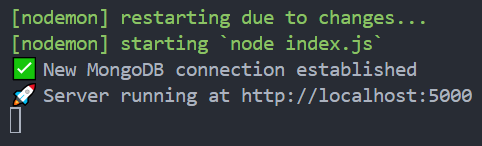

# GitHub Center - Backend

This is the backend service for **GitHub Center**, built with **Node.js**, **Express.js**, **MongoDB**, and **Clerk Authentication**.  
It provides secure APIs for managing GitHub accounts, repositories, groups, Personal Access Tokens (PAT), and user authentication.

---

## 🚀 Overview

The backend is responsible for:

- Handling authentication with Clerk.
- Listening to Clerk webhooks to store user information in MongoDB upon registration.
- Integrating with the GitHub API to fetch repository, workflow, and pull request data.
- Managing multiple GitHub accounts per user.
- Organizing repositories into custom groups.
- Storing and encrypting GitHub Personal Access Tokens (PATs).

---

## ✨ Features

### **Authentication & User Management**

- User authentication via **Clerk**.
- Clerk **webhook** automatically stores new users in MongoDB when they register.
- Secure storage of user data.

### **GitHub Account Management**

- Add, remove, and reset GitHub accounts.
- View detailed information about connected GitHub accounts.

### **Repository Grouping**

- Create, update, and delete groups.
- Add or remove repositories from groups.

### **Personal Access Token (PAT) Management**

- Create and store encrypted PATs.
- Update PATs or rename them.
- Retrieve stored PAT details securely.

### **Repository & Workflow Management**

- Fetch repositories from the GitHub API.
- View already selected repositories.
- Add or remove repositories from selection.
- Retrieve PR and workflow details for repositories.

---

## 🛠 Tech Stack

- **Node.js** + **Express.js** — REST API framework.
- **MongoDB** — Database for storing users, groups, accounts, and tokens.
- **Clerk** — Authentication and user management.
- **Ngrok** — For local webhook testing.
- **Crypto** — For encrypting Personal Access Tokens.

---

## 📦 Installation & Setup

### **1. Clone the repository**
```bash
git clone https://github.com/your-username/github-center-backend.git
cd github-center-backend


### **2. Install dependencies**
```bash
npm install


### **3. Environment Variables (.env)**
```bash
PORT=5000
MONGO_URI=your_mongo_connection_string

CLERK_SECRET_KEY=your_clerk_secret_key (start with sk_test)
CLERK_PUBLISHABLE_KEY=your_clerk_publishable_key (start with pk_test)
CLERK_SIGN_IN_URL=your_clerk_sign_in_url (ie. http://localhost:5173/signin)
LOGIN_URL=your_frontend_login_url (ie. http://localhost:5173)

ENCRYPTION_KEY=32_character_secret_key (ie. 781w8232d9ed4edfabcf9ed2b1a0eecb0e3tt96d3857f6ef1c53b2cf7a3fc1o5)


Note:

- **ENCRYPTION_KEY** must be exactly 32 characters for AES-256 encryption.
- **CLERK_SIGN_IN_URL** and **LOGIN_URL** must point to your frontend routes.

### **4. Setting Up Clerk Webhook**

The backend listens for a **Clerk webhook** when a new user registers.

---

#### 📜 Webhook Flow

1. **User signs up** in the frontend via Clerk.
2. Clerk sends a **POST** request to `/create` endpoint with user data.
3. Backend stores the user in **MongoDB** if they don't already exist.

---

#### 🛠 Local Development with Ngrok

> Clerk requires a **public URL** for webhooks.

##### 1. Install ngrok
```bash
npm install -g ngrok


##### 2. Start your backend
```bash
npm run start


##### 3. Run ngrok to expose your local server
```bash
ngrok http 5000


##### 4. Copy the ngrok HTTPS URL and set it as your webhook URL in Clerk Dashboard.
```bash
https://your-ngrok-url.ngrok-free.app/create


##### 5. You can persist this ngrok url other wise everytime you expose your port with command 3, you will get different url.

## 📸 Screenshots / Demo


